<h1 align="center"> Awesome-Federated-CDR </a></h2>
<h5 align="center"> If you like our project, please give us a star ⭐ on GitHub for the latest update.</h5>


Note: To prevent unauthorized use or plagiarism, this repository is currently hosted on a hidden URL (https://yudixiong.github.io/awesome/FCDR.html). The contents will be made publicly available on our main GitHub repository (https://github.com/YudiXiong/Awesome) immediately after acceptance at IJCAI 2026 survey track.


<h5 align="center">

 

> To facilitate readers and researchers in following relevant problems, our repository organizes all the related work based on problem settings and data inputs. In contrast, our paper summarizes, categorizes, and discusses related work from both macro (multiple perspectives) and micro views, providing a deeper understanding of the core aspects of FCDR and helping to identify new research opportunities.
>
> This is a collection of papers on leveraging **Federated Learning** in **Cross-Domain Recommendation**. 
> It's based on our survey paper: A Survey on Federated Cross-Domain Recommendation. 

> We will try to make this list updated frequently. If you found any error or any missed paper, please don't hesitate to open issues or pull requests.

> Our survey has been submitted by IJCAI 2026 survey track.

## What is Federated Cross-Domain Recommendation? 

As shown in Figure 1, FCDR integrates information from multiple domains (e.g., music, movies, books) to train a model without compromising user privacy, thereby better serving users for each domain. For example, after watching a romantic movie, users may be inclined to read novels of a similar genre, or after listening to a particular style of music, they may develop an interest in related movies or books. Each domain involves multiple types of data, which can be categorized into three parts: user-side (e.g., user profiles, social relations), item-side (e.g., item attributes, product images), and user-item interactions (e.g., implicit feedback, reviews). User-side and user-item data usually contains privacy, whereas item-side data is often public. FCDR presents the following challenges: efficiently enabling communication and learning across domains, effectively leveraging various types of data, and securely transmitting or aggregating data from multiple domains.

<p align="center">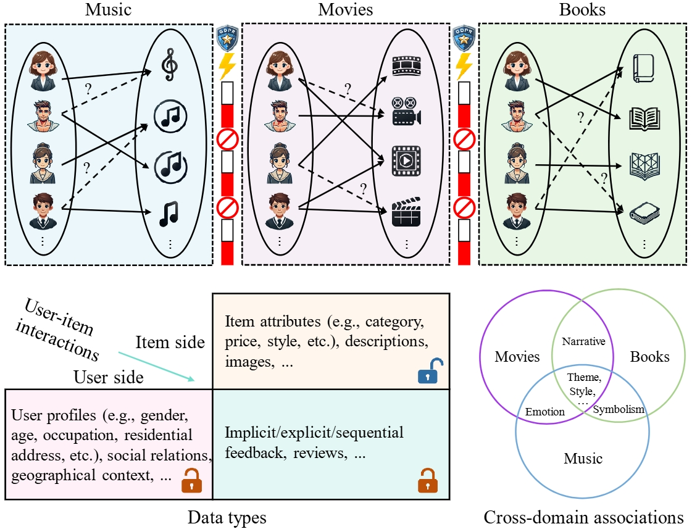</p>
<p align="center"><em>Figure 1.</em> Federated recommendation across three domains.</p>


## A Systematic Overview of the Existing Models

<p align="center">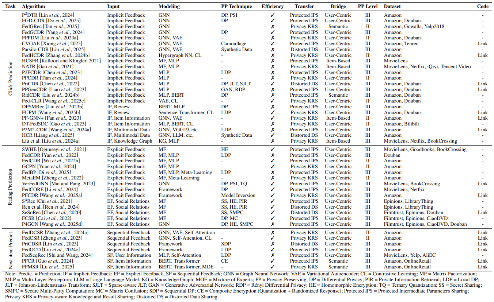</p>

<p align="left"><em>Table 1.</em> A systematic overview of the existing models on federated cross-domain recommendation.</p >

## A Schematic Overview of the Main Technical Architecture

<p align="center">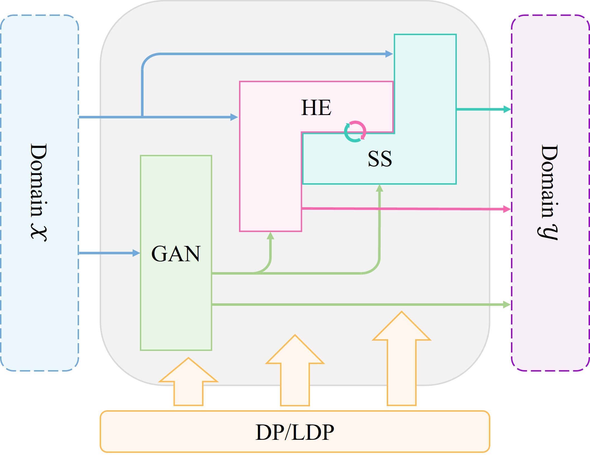</p>

<p align="left"><em>Figure 2.</em> A schematic overview of the main technical architecture. The arrow colors represent the output after passing through components of different colors. DP/LDP can be incorporated at any stage of the process, allowing for flexible integration. Components can function in parallel or sequentially. Depending on specific data scenarios and varying protection requirements, appropriate techniques can be utilized based on their respective characteristics.</p >

## Summary of Representative Open-Source Algorithms

<p align="center"></p>

<p align="left"><em>Table 2.</em> Summary of representative open-source algorithms in federated cross-domain recommendation.</p >

## Table of Contents

- [Awesome-Federated-CDR](#Awesome-Federated-CDR)
  - [What is federated cross-domain recommendation](#What is federated cross-domain recommendation?)
  - [A Systematic Overview of the Existing Models](#A Systematic Overview of the Existing Models)
  - [A Schematic Overview of the Main Technical Architecture](#A Schematic Overview of the Main Technical Architecture)
  - [Summary of Representative Open-Source Algorithms](#Summary of Representative Open-Source Algorithms)
  - [Table of Contents](#table-of-contents)
  - [Implicit Feedback for FCDR](#Implicit Feedback for FCDR)
  - [Explicit Feedback for FCDR](#Explicit Feedback for FCDR)
  - [Sequential Feedback for FCDR](#Sequential Feedback for FCDR)
  - [Others](#others)
  - [Summary of FCDR Model Performance](#Summary of FCDR Model Performance)
  - [Contributing](#contributing)
  - [Cite Us](#cite-us)


## Implicit Feedback for FCDR
* (_2019_) [WWW' 2019] **Cross-domain Recommendation Without Sharing User-relevant Data** [[Paper](https://dl.acm.org/doi/10.1145/3308558.3313538)]
  
   <details close>
   <summary>NATR</summary>
   <p align="center">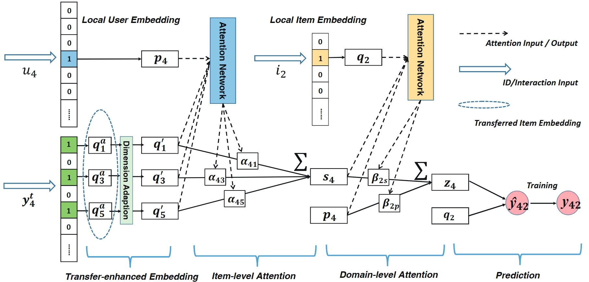</p>
   <p align="center"><em>The framework of NATR.</em></p>
   </details>
   
* (_2021_) [RecSys' 2021] **Horizontal Cross-Silo Federated Recommender Systems** [[Paper](https://dl.acm.org/doi/abs/10.1145/3460231.3478863)]
  
   <details close>
   <summary>Framework</summary>
   <p align="center">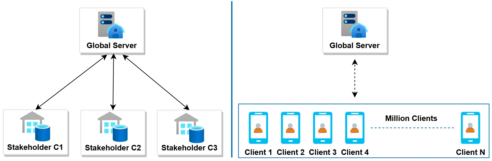</p>
   <p align="center"><em>The framework of Kalloori et al.</em></p>
   </details>
   
* (_2021_) [TKDD' 2021] **Cross-domain  Recommendation with Bridge-Item Embeddings** [[Paper](https://dl.acm.org/doi/10.1145/3447683)]
  
   <details close>
   <summary>NATR (same figure)</summary>
   <p align="center">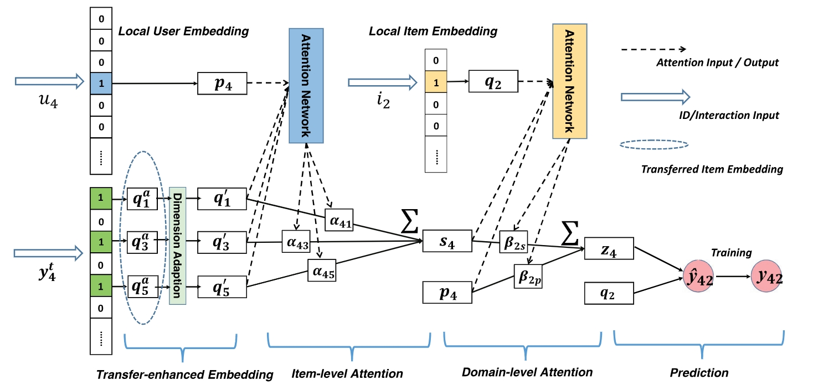</p>
   <p align="center"><em>The framework of NATR.</em></p>
   </details>
   
* (_2022_) [WWW' 2022] **Differential Private Knowledge Transfer for Privacy-Preserving Cross-Domain Recommendation** [[Paper](https://dl.acm.org/doi/10.1145/3485447.3512192) | [Code](https://drive.google.com/file/d/139TbpfcaUs7A5MbqFt1IzYmuayJWK3cv/view)]
  
   <details close>
   <summary>PriCDR</summary>
   <p align="center">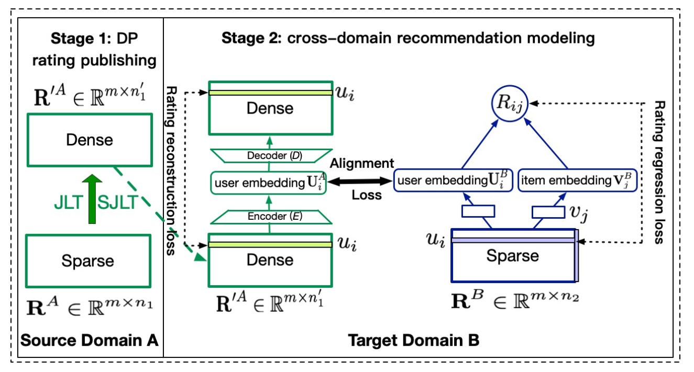</p>
   <p align="center"><em>The framework of PriCDR.</em></p>
   </details>
   
* (_2023_) [AAAI' 2023] **Win-Win: A Privacy-Preserving Federated Framework for Dual-Target Cross-Domain Recommendation** [[Paper](https://ojs.aaai.org/index.php/AAAI/article/view/25531)]
  
   <details close>
   <summary>P2FCDR</summary>
   <p align="center">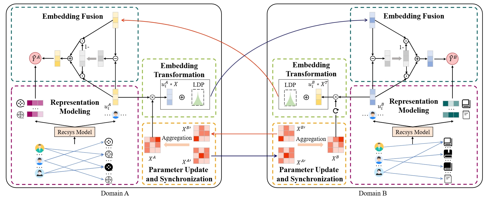</p>
   <p align="center"><em>The framework of P2FCDR.</em></p>
   </details>
   
* (_2023_) [IJCAI' 2023] **Federated Probabilistic Preference Distribution Modelling with Compactness Co-Clustering for Privacy-Preserving Multi-Domain Recommendation** [[Paper](https://www.ijcai.org/proceedings/2023/0245.pdf)]
   <details close>
   <summary>FPPDM</summary>
   <p align="center">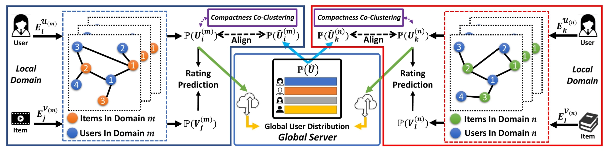</p>
   <p align="center"><em>The framework of FPPDM.</em></p>
   </details>
   
* (_2023_) [UAI' 2023] **Personalized Federated Domain Adaptation for Item-to-Item Recommendation** [[Paper](https://arxiv.org/abs/2306.03191) | [Code](https://github.com/zfan20/PFGNNPlus)]
   <details close>
   <summary>PFGNN+</summary>
   <p align="center">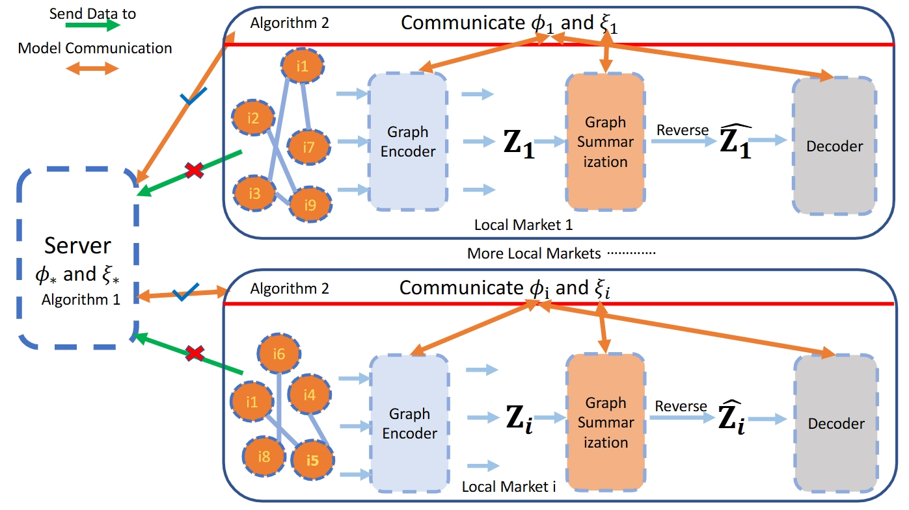</p>
   <p align="center"><em>The framework of PFGNN+.</em></p>
   </details>
   
* (_2023_) [GPC' 2023] **FEDRKG:  A Privacy-preserving Federated Recommendation Framework via Knowledge Graph  Enhancement** [[Paper](https://link.springer.com/chapter/10.1007/978-981-99-9896-8_6)]
   <details close>
   <summary>FEDRKG</summary>
   <p align="center">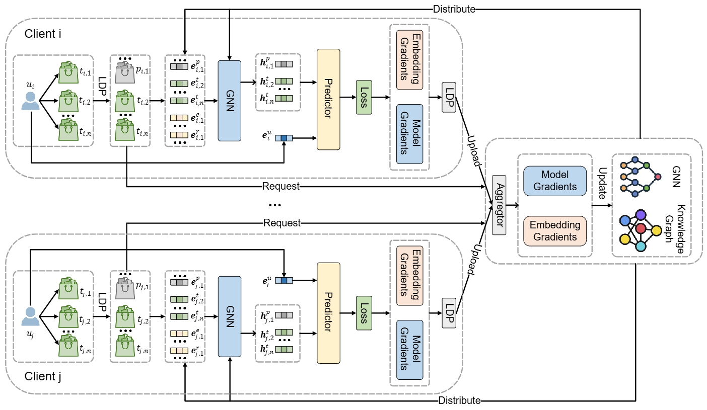</p>
   <p align="center"><em>The framework of FEDRKG.</em></p>
   </details>
   
* (_2023_) [AAAI' 2023] **PPGenCDR:  A Stable and Robust Framework for Privacy-Preserving  Cross-Domain Recommendation** [[Paper](https://arxiv.org/abs/2305.16163) | [Code](https://github.com/XeniaLLL/PPGenCDR)]
   <details close>
   <summary>PPGenCDR</summary>
   <p align="center">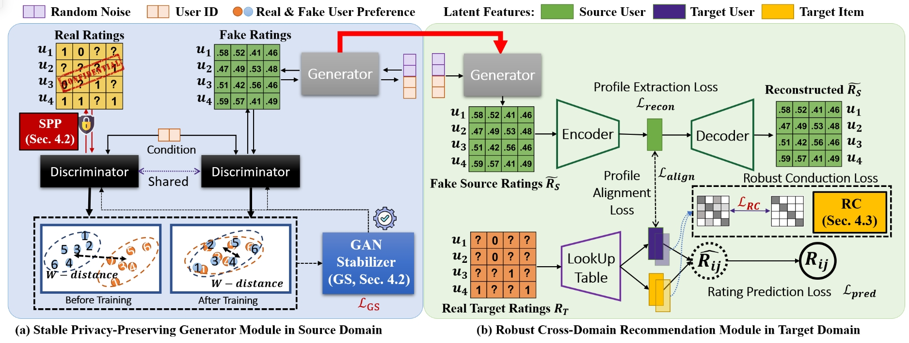</p>
   <p align="center"><em>The framework of PPGenCDR.</em></p>
   </details>
   
* (_2023_) [MM' 2023] **Differentially Private Sparse Mapping  for Privacy-Preserving Cross Domain Recommendation** [[Paper](https://dl.acm.org/doi/10.1145/3581783.3611924)]
   <details close>
   <summary>DPSMRec</summary>
   <p align="center">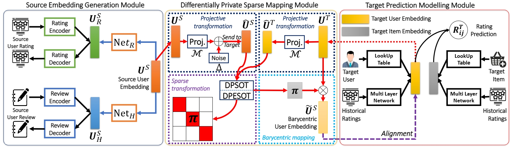</p>
   <p align="center"><em>The framework of DPSMRec.</em></p>
   </details>

* (_2024_) [KBS' 2024] **A Privacy-Preserving Framework with Multi-Modal Data for Cross-Domain Recommendation** [[Paper](https://www.sciencedirect.com/science/article/pii/S0950705124011638)]
  
   <details close>
   <summary>P2M2-CDR</summary>
   <p align="center">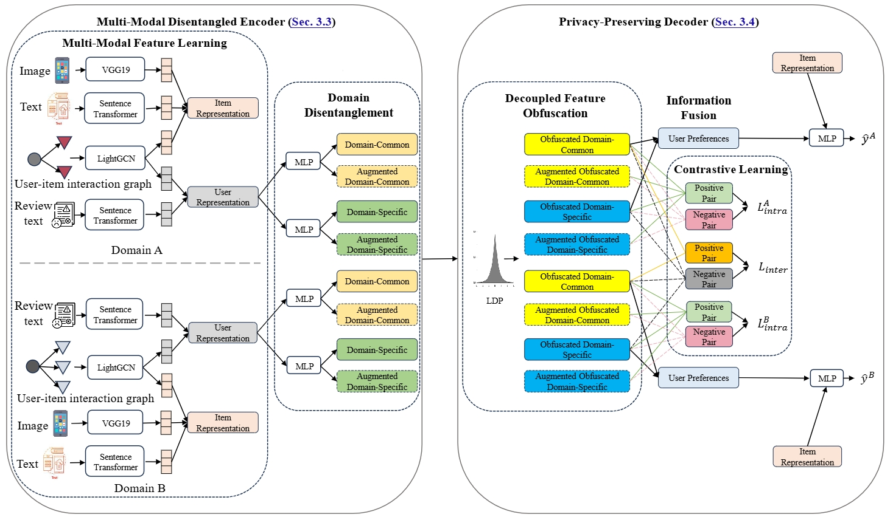</p>
   <p align="center"><em>The framework of P2M2-CDR.</em></p>
   </details>
   
* (_2024_) [TOIS' 2024] **Privacy-preserving Cross-domain Recommendation with Federated Graph Learning** [[Paper](https://dl.acm.org/doi/10.1145/3653448)]
  
   <details close>
   <summary>PPCDR</summary>
   <p align="center">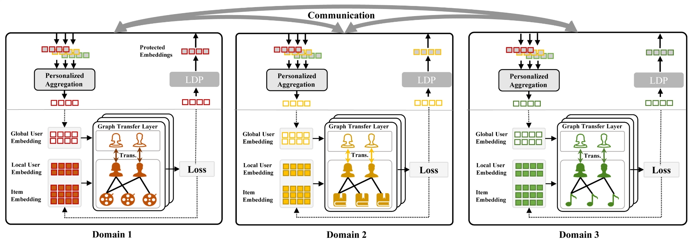</p>
   <p align="center"><em>The framework of PPCDR.</em></p>
   </details>
   
* (_2024_) [TMM' 2024] **Privacy-preserving Multi-source Cross-domain Recommendation Based on Knowledge Graph** [[Paper](https://dl.acm.org/doi/abs/10.1145/3639706)]
  
   <details close>
   <summary>Multi-source CDR</summary>
   <p align="center"></p>
   <p align="center"><em>The framework of Multi-source CDR.</em></p>
   </details>
   
* (_2024_) [ICML' 2024] **Reducing Item Discrepancy via Differentially Private Robust Embedding Alignment for Privacy-Preserving Cross-Domain Recommendation** [[Paper](https://proceedings.mlr.press/v235/liu24cf.html)]
  
   <details close>
   <summary>RidCDR</summary>
   <p align="center">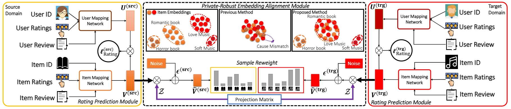</p>
   <p align="center"><em>The framework of RidCDR.</em></p>
   </details>
   
* (_2024_) [ECML PKDD' 2024] **FedHCDR: Federated Cross-Domain Recommendation with Hypergraph Signal Decoupling** [[Paper](https://link.springer.com/chapter/10.1007/978-3-031-70341-6_21) | [Code](https://github.com/orion-orion/FedHCDR)]
  
   <details close>
   <summary>FedHCDR</summary>
   <p align="center">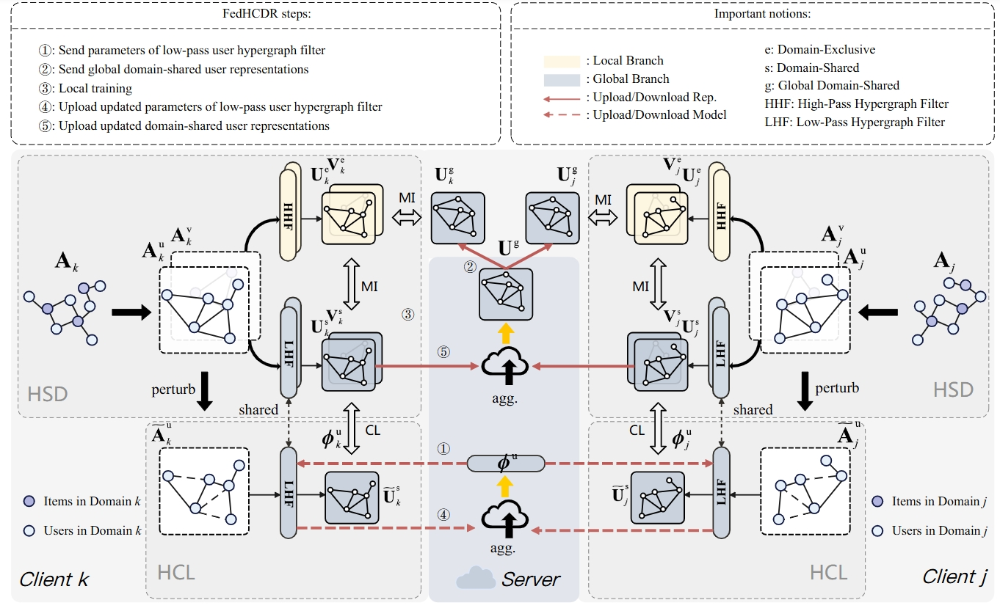</p>
   <p align="center"><em>The framework of FedHCDR.</em></p>
   </details>
   
* (_2024_) [WWW' 2024] **Towards Efficient Communication and Secure Federated Recommendation System via Low-rank Training** [[Paper](https://dl.acm.org/doi/10.1145/3589334.3645702)]
  
   <details close>
   <summary>CoLR</summary>
   <p align="center">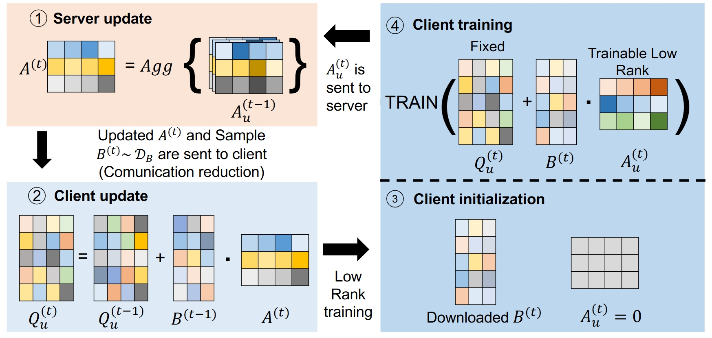</p>
   <p align="center"><em>The framework of CoLR.</em></p>
   </details>
   
* (_2024_) [NeurIPS' 2024] **Federated Graph Learning for Cross-Domain Recommendation** [[Paper](https://proceedings.neurips.cc/paper_files/paper/2024/file/774164b966cc277c82a960934445140d-Paper-Conference.pdf)]
  
   <details close>
   <summary>FedGCDR</summary>
   <p align="center">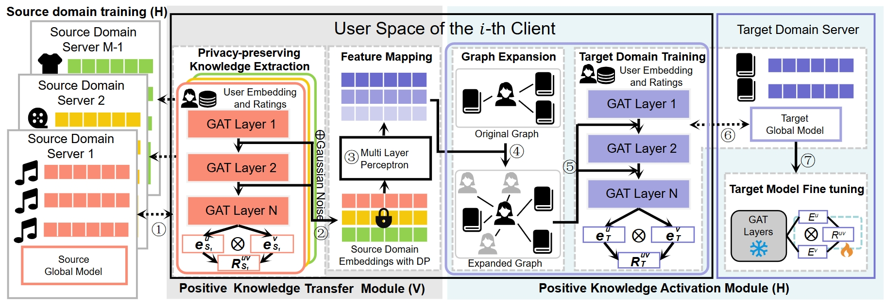</p>
   <p align="center"><em>The framework of FedGCDR.</em></p>
   </details>
   
* (_2025.01_) [TSC' 2025] **Federated Contrastive Learning for Cross-Domain Recommendation** [[Paper](https://ieeexplore.ieee.org/document/10842506)]
  
   <details close>
   <summary>Fed-CLR</summary>
   <p align="center">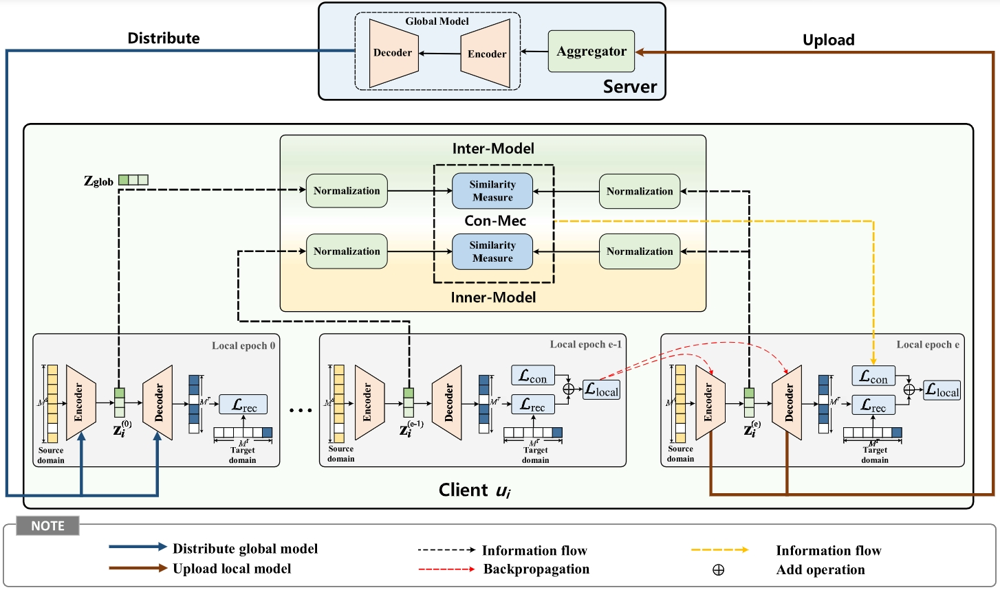</p>
   <p align="center"><em>The framework of Fed-CLR.</em></p>
   </details>
   
* (_2025.03_) [TMM' 2025] **Federated User Preference Modeling  for Privacy-Preserving Cross-Domain Recommendation** [[Paper](https://ieeexplore.ieee.org/document/10909694) | [Code](https://github.com/Lili1013/FUPM)]
  
   <details close>
   <summary>FUPM</summary>
   <p align="center">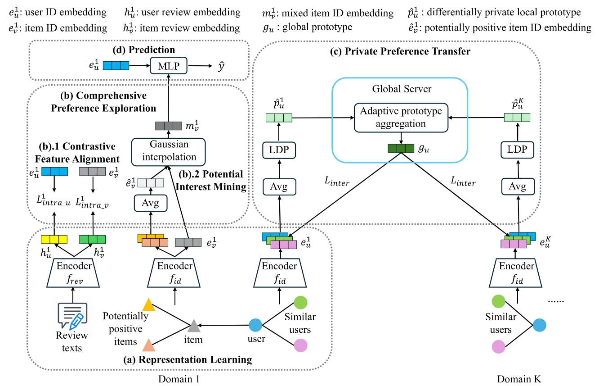</p>
   <p align="center"><em>The framework of FUPM.</em></p>
   </details>
   
* (_2025.04_) [AAAI' 2025] **Enhancing Healthcare Recommendations: A Privacy-Protective and Interpretable Cross-Domain Framework** [[Paper](https://ojs.aaai.org/index.php/AAAI/article/view/33322) | [Code](https://github.com/zyl-mc/HCR)]
  
   <details close>
   <summary>HCR</summary>
   <p align="center">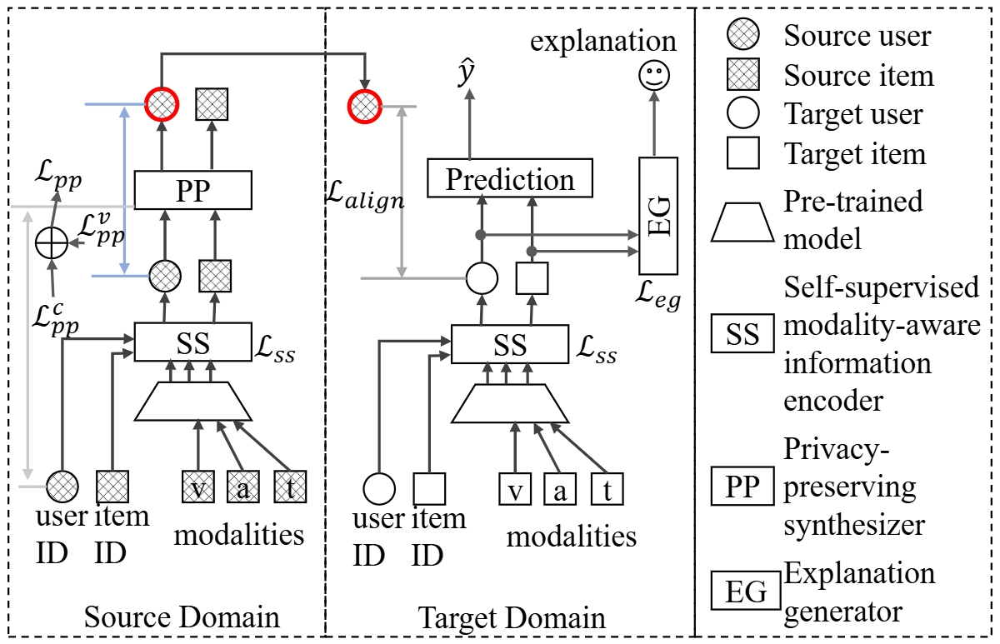</p>
   <p align="center"><em>The framework of HCR.</em></p>
   </details>
   
* (_2025.04_) [TKDE' 2025] **Camouflaged Variational Graph AutoEncoder Against Attribute Inference Attacks for Cross-Domain Recommendation** [[Paper](https://ieeexplore.ieee.org/document/10980364) | [Code](https://github.com/YudiXiong/CVGAE)]
  
   <details close>
   <summary>CVGAE</summary>
   <p align="center">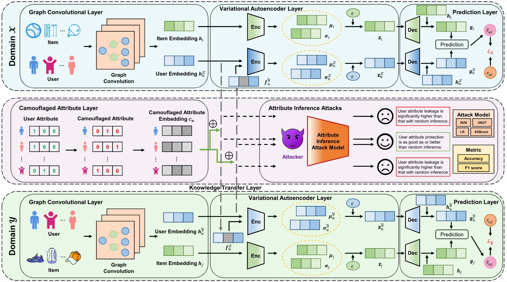</p>
   <p align="center"><em>The framework of CVGAE.</em></p>
   </details>
   
* (_2025.05_) [arXiv' 2025] **FedGRec: Dynamic Spatio-Temporal Federated Graph Learning for Secure and Efficient Cross-Border Recommendations** [[Paper](https://arxiv.org/abs/2505.18177)]
  
   <details close>
   <summary>FedGRec</summary>
   <p align="center">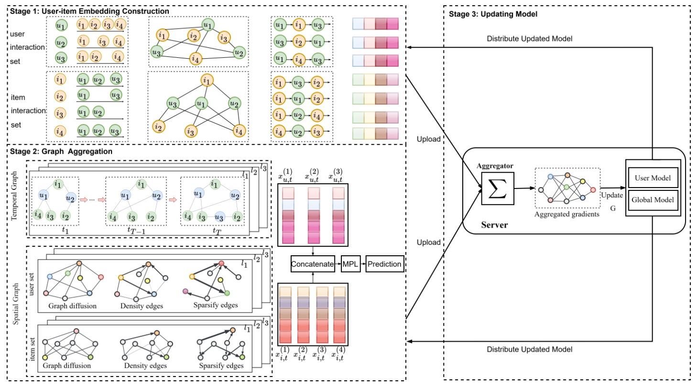</p>
   <p align="center"><em>The framework of FedGRec.</em></p>
   </details>
   
* (_2025.07_) [TIST' 2025] **A Federated Graph Neural Network with Differential Privacy for Cross-domain Recommender Systems** [[Paper](https://dl.acm.org/doi/10.1145/3742791)]
  
   <details close>
   <summary>FGD-CDR</summary>
   <p align="center">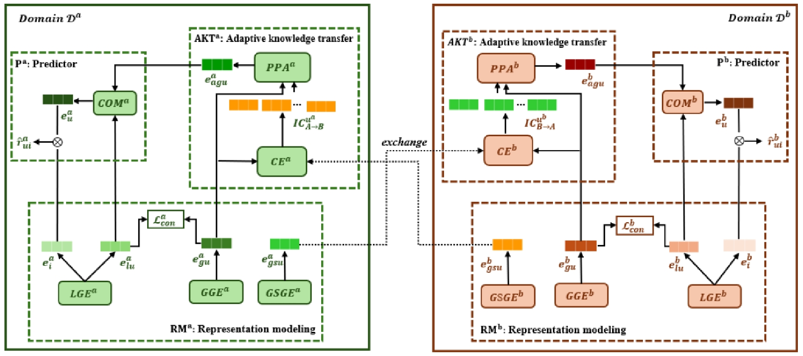</p>
   <p align="center"><em>The framework of FGD-CDR.</em></p>
   </details>
   
* (_2025.11_) [KBS' 2025] **Parsilo-CDR: Privacy-aware cross-domain recommendation for data silo** [[Paper](https://www.sciencedirect.com/science/article/pii/S0950705125013887)]
  
   <details close>
   <summary>Parsilo-CDR</summary>
   <p align="center">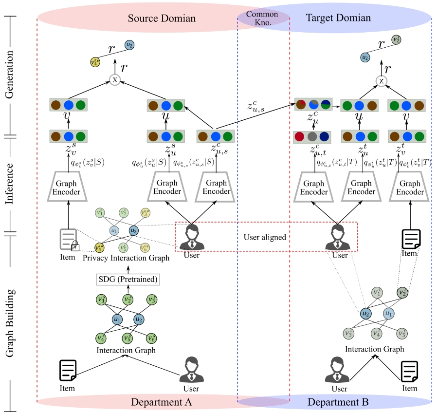</p>
   <p align="center"><em>The framework of Parsilo-CDR.</em></p>
   </details>
   
* (_2025.11_) [CIKM' 2025] **DT-FedSDC: A Dual-Target Federated Framework with Semantic Enhancement and Disentangled Contrastive Learning for Cross-Domain Recommendation** [[Paper](https://dl.acm.org/doi/10.1145/3746252.3761270)]
  
   <details close>
   <summary>DT-FedSDC</summary>
   <p align="center">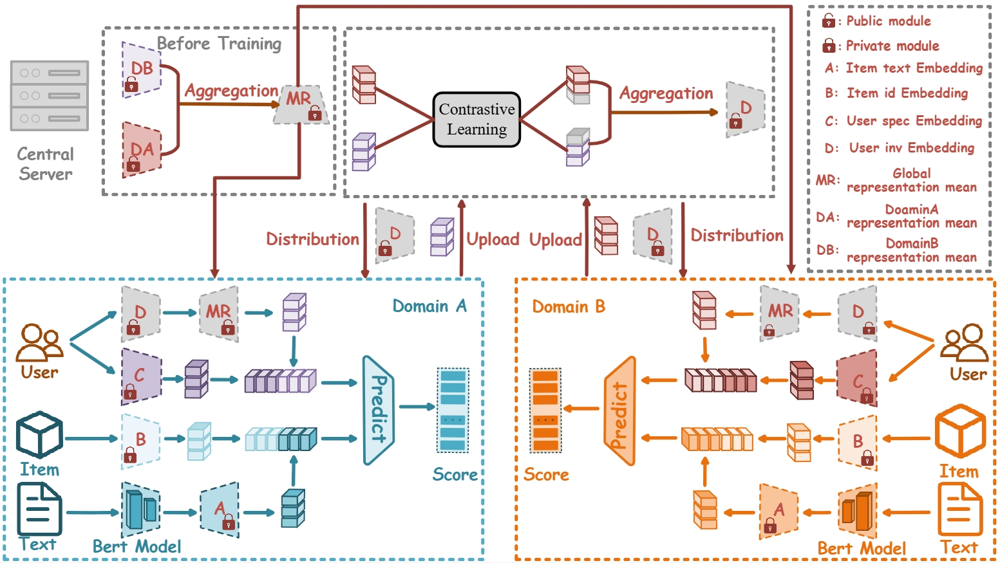</p>
   <p align="center"><em>The framework of DT-FedSDC.</em></p>
   </details>

## Explicit Feedback for FCDR

* (_2020_) [TIST' 2020] **Mediated Secure Multi-Party Protocols for Collaborative Filtering** [[Paper](https://dl.acm.org/doi/abs/10.1145/3375402)]
  
   <details close>
   <summary>Abstract (No Framework)</summary>
   <p align="center">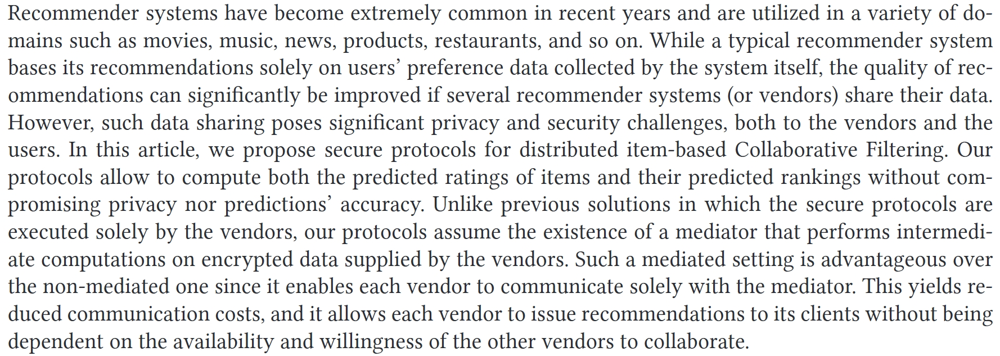</p>
   <p align="center"><em>The abstract of Shmueli et al.</em></p>
   </details>
   
* (_2020_) [TKDD' 2020] **Data Sharing via Differentially Private Coupled Matrix Factorization** [[Paper](https://dl.acm.org/doi/abs/10.1145/3372408)]
  
   <details close>
   <summary>DP-CMF</summary>
   <p align="center">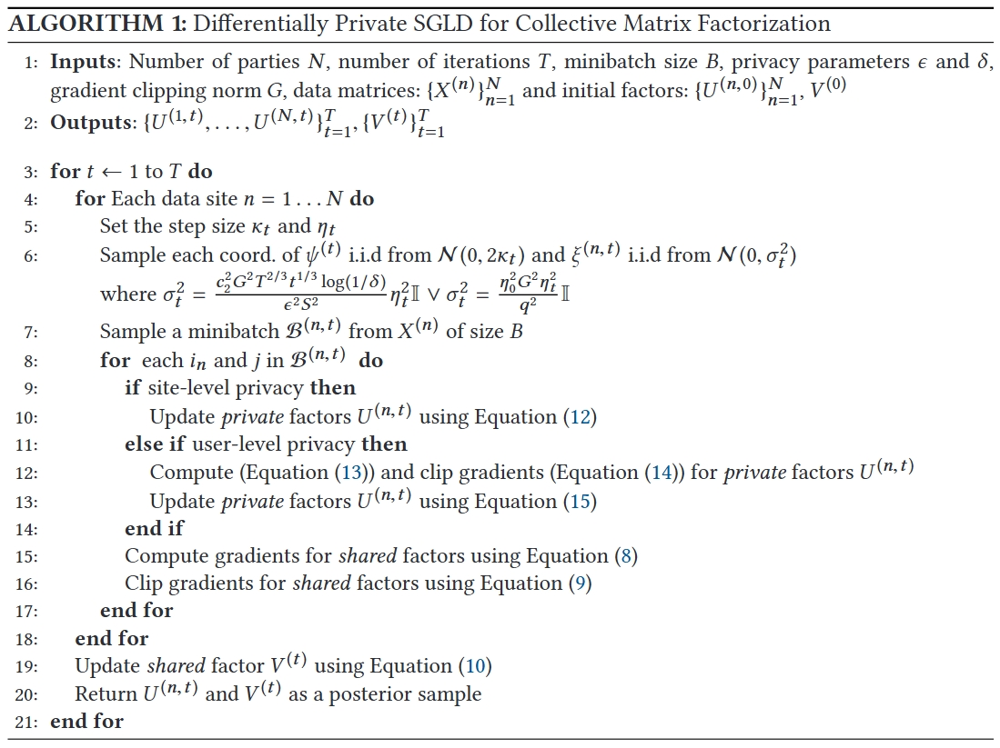</p>
   <p align="center"><em>The algorithm of DP-CMF.</em></p>
   </details>
   
* (_2021_) [IEEE Intelligent Systems' 2021] **Secure Federated Matrix Factorization** [[Paper](https://ieeexplore.ieee.org/document/9162459) | [Code](https://github.com/Di-Chai/FedMF)]
  
   <details close>
   <summary>FedMF</summary>
   <p align="center">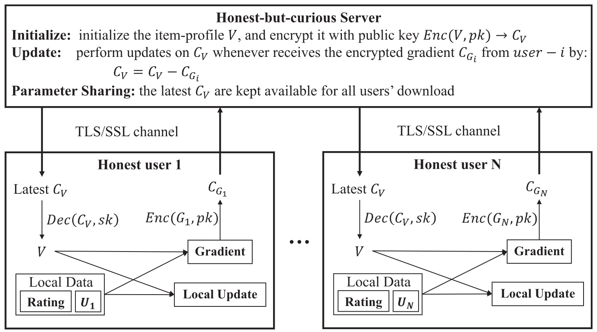</p>
   <p align="center"><em>The algorithm of FedMF.</em></p>
   </details>
   
* (_2021_) [EIECS' 2021] **A  vertical federation recommendation method based on clustering and latent  factor model** [[Paper](https://ieeexplore.ieee.org/document/9587935)]
  
   <details close>
   <summary>CLMF-VFL</summary>
   <p align="center">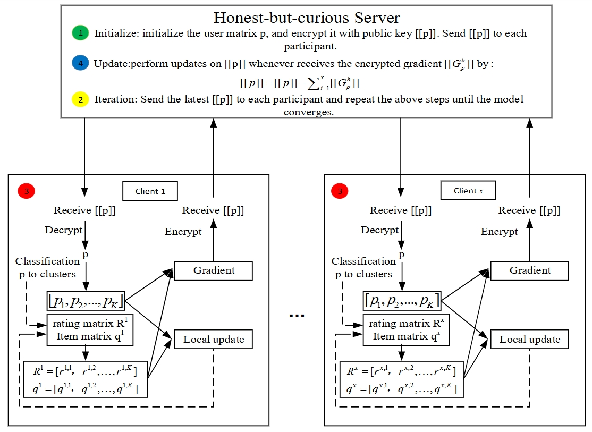</p>
   <p align="center"><em>The framework of CLMF-VFL.</em></p>
   </details>
   
* (_2021_) [KBS' 2021] **FCMF:  Federated Collective Matrix Factorization for Heterogeneous Collaborative  Filtering** [[Paper](https://www.sciencedirect.com/science/article/abs/pii/S0950705121002094)]
  
   <details close>
   <summary>FCMF</summary>
   <p align="center">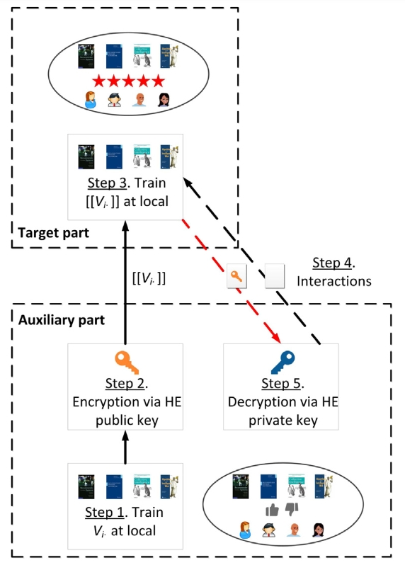</p>
   <p align="center"><em>The framework of FCMF.</em></p>
   </details>
   
* (_2022_) [DCN' 2022] **FedCDR:  Privacy-preserving federated cross-domain recommendation** [[Paper](https://www.sciencedirect.com/science/article/pii/S2352864822000839)]
  
   <details close>
   <summary>FedCDR</summary>
   <p align="center">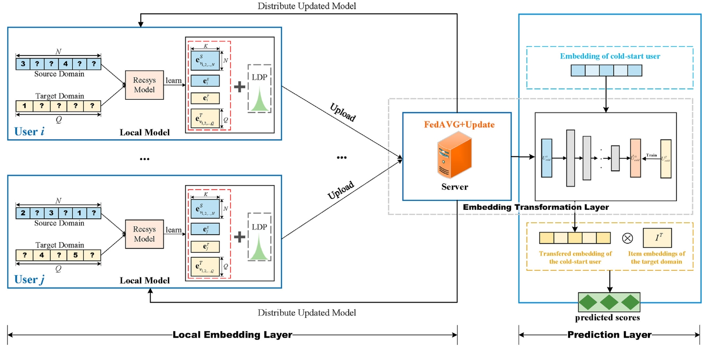</p>
   <p align="center"><em>The framework of FedCDR.</em></p>
   </details>
   
* (_2022_) [CIKM' 2022] **FedCDR:  Federated Cross-Domain Recommendation for Privacy-Preserving Rating  Prediction** [[Paper](https://dl.acm.org/doi/10.1145/3511808.3557320)]
   <details close>
   <summary>FedCDR</summary>
   <p align="center">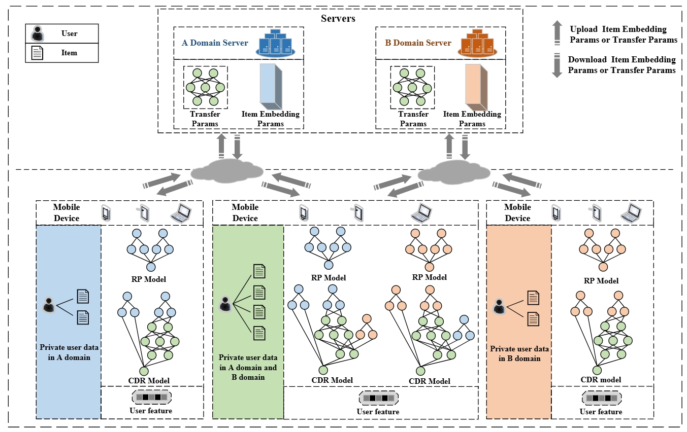</p>
   <p align="center"><em>The framework of FedCDR.</em></p>
   </details>
   
* (_2022_) [CollaborateCom' 2022] **MetaEM:  Meta Embedding Mapping for Federated Cross-domain Recommendation  to Cold-Start Users** [[Paper](https://link.springer.com/chapter/10.1007/978-3-031-24383-7_9)]
   <details close>
   <summary>MetaEM</summary>
   <p align="center">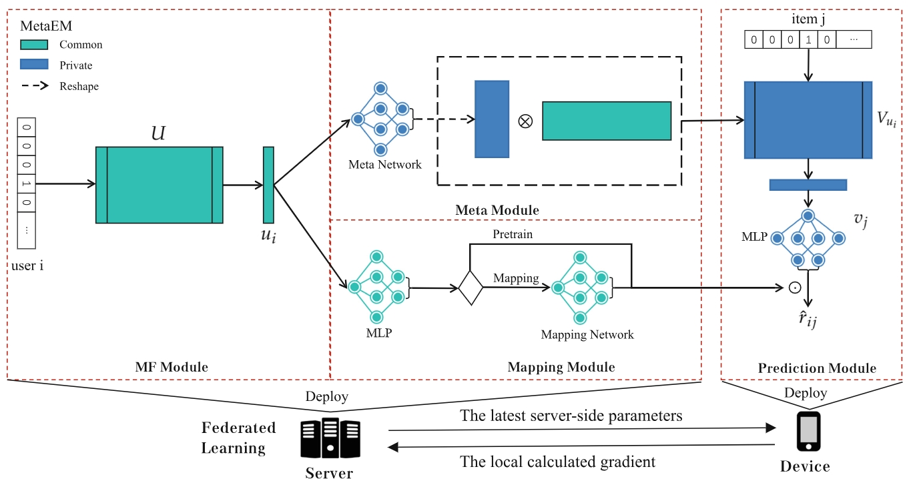</p>
   <p align="center"><em>The framework of MetaEM.</em></p>
   </details>
   
* (_2023_) [ICML' 2023] **Vertical Federated Graph Neural Network for Recommender System** [[Paper](https://icml.cc/virtual/2023/poster/24717) | [Code](https://github.com/maiph123/VerticalGNN)]
   <details close>
   <summary>VerFedGNN</summary>
   <p align="center">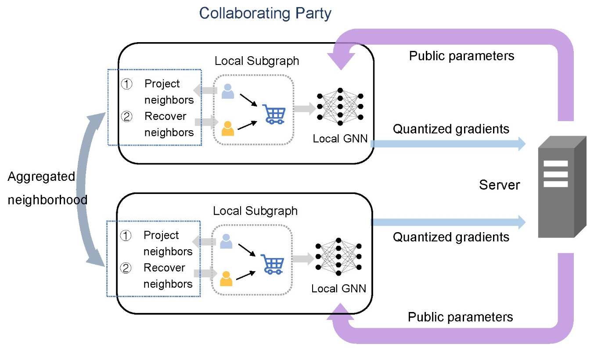</p>
   <p align="center"><em>The framework of VerFedGNN.</em></p>
   </details>
   
* (_2023_) [TII' 2023] **Federated Learning-Based Cross-Enterprise Recommendation  With Graph Neural Networks** [[Paper](https://ieeexplore.ieee.org/document/9873989)]
   <details close>
   <summary>FL-GMT</summary>
   <p align="center">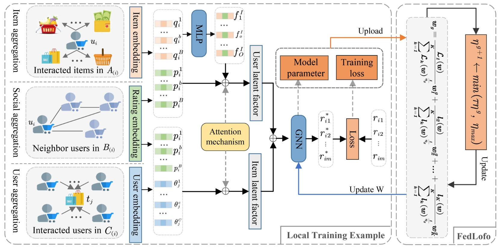</p>
   <p align="center"><em>The framework of FL-GMT.</em></p>
   </details>
   
* (_2023_) [IEEE Access' 2023] **Privacy-Preserving Matrix  Factorization for Cross-Domain  Recommendation** [[Paper](https://ieeexplore.ieee.org/document/9462100)]
   <details close>
   <summary>SWHE-MF</summary>
   <p align="center">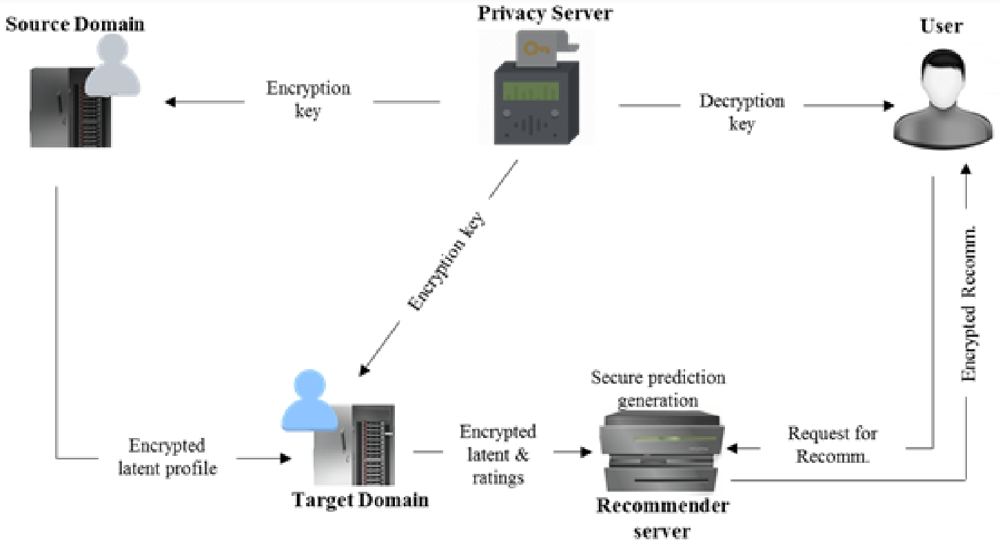</p>
   <p align="center"><em>The framework of SWHE-MF.</em></p>
   </details>
   
* (_2023_) [ECAI' 2023] **Secure Social Recommendation based on Secret Sharing** [[Paper](http://ecai2020.eu/papers/609_paper.pdf) | [Code](https://github.com/encryptogroup/ABY)]
   <details close>
   <summary>SeSoRec</summary>
   <p align="center">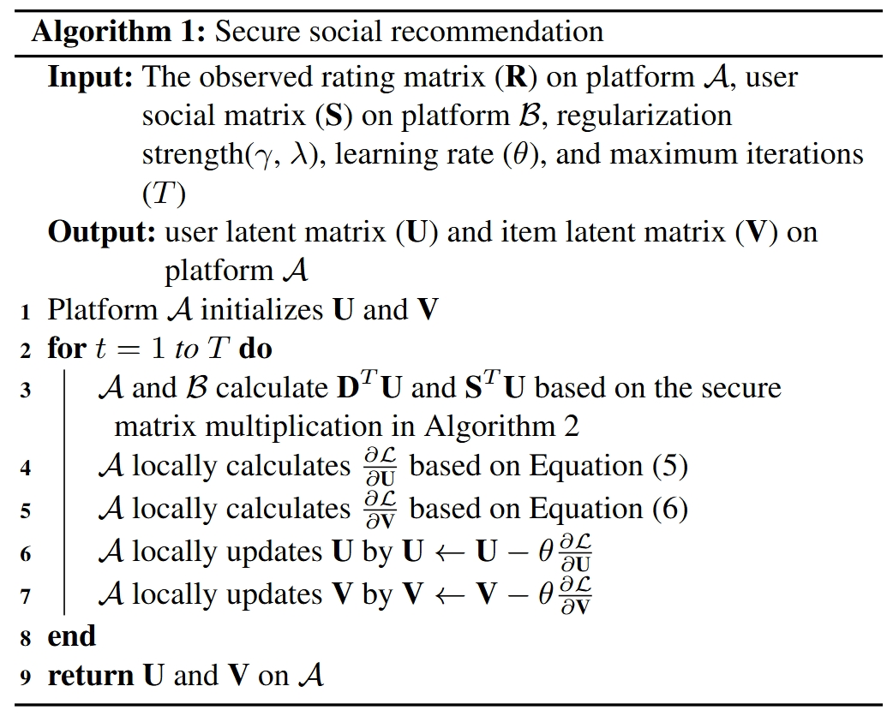</p>
   <p align="center"><em>The algorithm of SeSoRec.</em></p>
   </details>
   
* (_2023_) [CEE' 2023] **A Privacy-Preserving Framework for Horizontal Cross-Silo Federated  Recommender SystemsCross-Domain Recommender Systems** [[Paper](https://www.sciencedirect.com/science/article/abs/pii/S004579062100207X)]
   <details close>
   <summary>Framework</summary>
   <p align="center">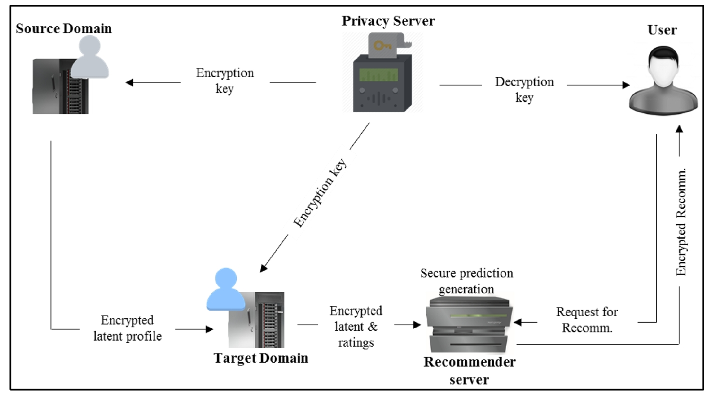</p>
   <p align="center"><em>The algorithm of Ogunseyi et al.</em></p>
   </details>
   
* (_2024_) [TKDE' 2024] **FedCORE:  Federated Learning for Cross-Organization Recommendation  Ecosystem** [[Paper](https://ieeexplore.ieee.org/document/10443503)]

    <details close>
    <summary>FedCORE</summary>
    <p align="center">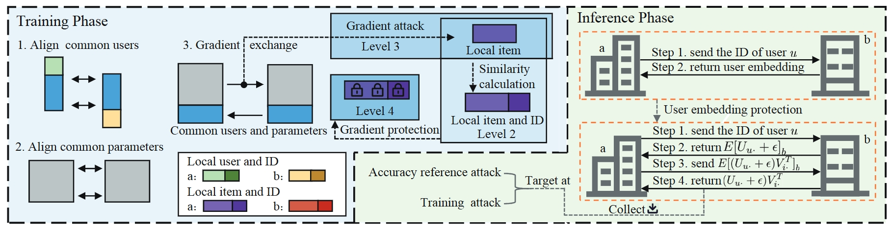</p>
    <p align="center"><em>The framework of FedCORE.</em></p>
    </details>
    
* (_2024_) [ICWS' 2024] **GCPN: A Group Connected based Method for Continual Vertical Federated Recommender Systems in Data Ecosystems** [[Paper](https://ieeexplore.ieee.org/document/10707571)]

    <details close>
    <summary>GCPN</summary>
    <p align="center">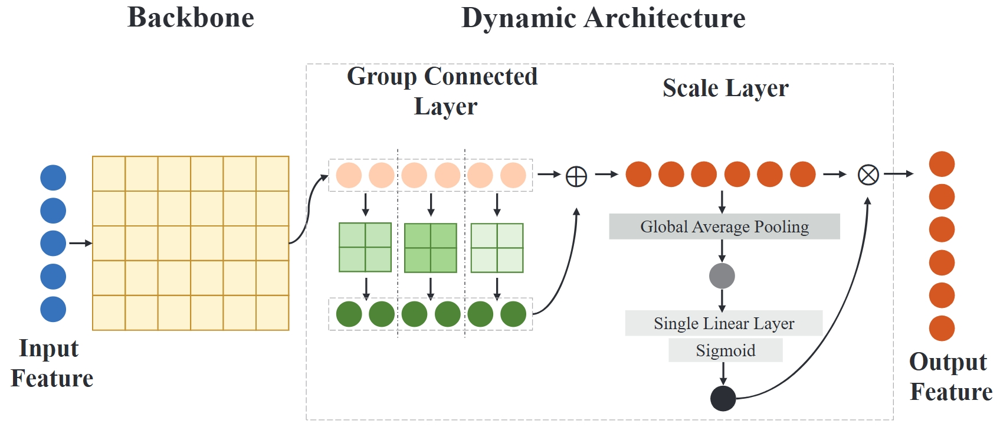</p>
    <p align="center"><em>The framework of GCPN.</em></p>
    </details>
    
* (_2024.12_) [KAIS' 2025] **Federated Cross-Domain Recommendation System Based on Bias Eliminator and Personalized Extractor** [[Paper](https://link.springer.com/article/10.1007/s10115-024-02316-y)]

    <details close>
    <summary>FedBP</summary>
    <p align="center">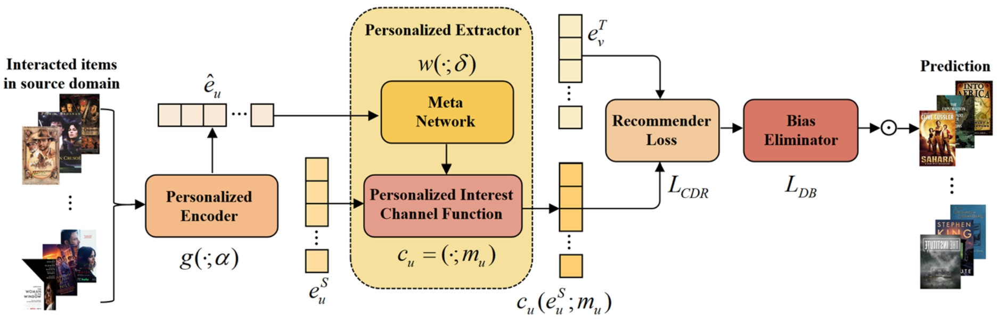</p>
    <p align="center"><em>The framework of FedBP.</em></p>
    </details>
    
* (_2025.04_) [WWW' 2025] **Privacy-Friendly Cross-Domain Recommendation via Distilling User-irrelevant Information** [[Paper](https://dl.acm.org/doi/10.1145/3696410.3714580) | [Code](https://github.com/walcheng/PFCDR)]

    <details close>
    <summary>PFCDR</summary>
    <p align="center">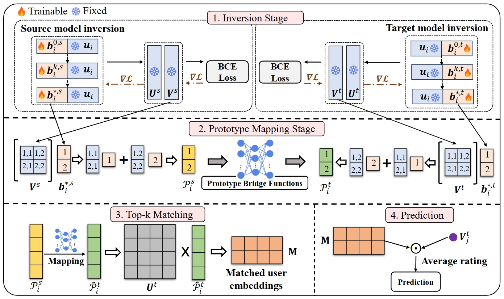</p>
    <p align="center"><em>The framework of PFCDR.</em></p>
    </details>
    
* (_2025.04_) [WWW' 2025] **P4GCN: Vertical Federated Social Recommendation with Privacy-Preserving Two-Party Graph Convolution Network** [[Paper](https://dl.acm.org/doi/abs/10.1145/3696410.3714721)]

    <details close>
    <summary>P4GCN</summary>
    <p align="center">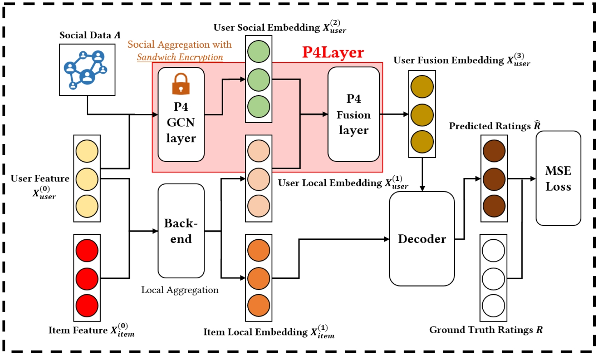</p>
    <p align="center"><em>The framework of P4GCN.</em></p>
    </details>
## Sequential Feedback for FCDR
* (_2020_) [APWeb-WAIM' 2020] **FedOCD:  A One-Shot Federated Framework  for Heterogeneous Cross-Domain Recommendation** [[Paper](https://link.springer.com/chapter/10.1007/978-981-97-7241-4_5) | [Code](https://github.com/AA-Ashley/FedOCD)]
   <details close>
   <summary>FedOCD</summary>
   <p align="center">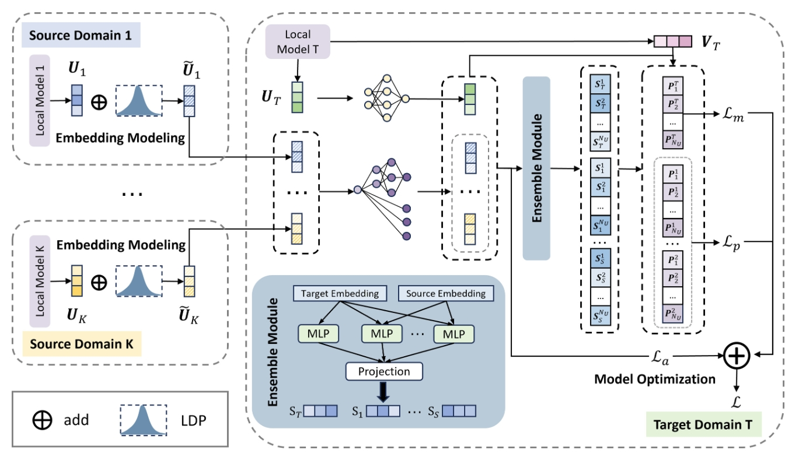</p>
   <p align="center"><em>The framework of FedOCD.</em></p>
   </details>
   
* (_2024_) [SDM' 2024] **FedDCSR:  Federated Cross-Domain  Sequential Recommendation  via Disentangled Representation Learning** [[Paper](https://epubs.siam.org/doi/10.1137/1.9781611978032.62) | [Code](https://github.com/orion-orion/FedDCSR)]
  
   <details close>
   <summary>FedDCSR</summary>
   <p align="center">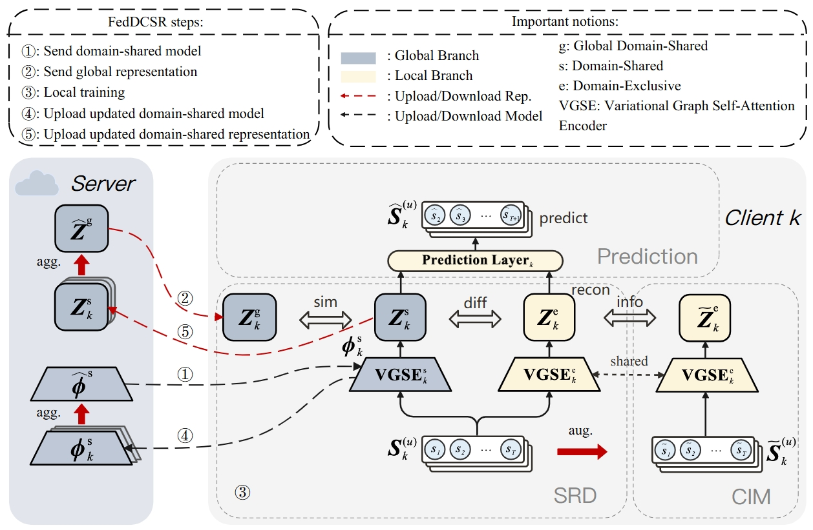</p>
   <p align="center"><em>The framework of FedDCSR.</em></p>
   </details>
   
* (_2024_) [ICDM' 2024] **Privacy-Preserving  Cross-Domain Sequential  Recommendation** [[Paper](https://ieeexplore.ieee.org/document/10415824) | [Code](https://github.com/LachlanLin/PriCDSR)]
  
   <details close>
   <summary>PriCDSR</summary>
   <p align="center">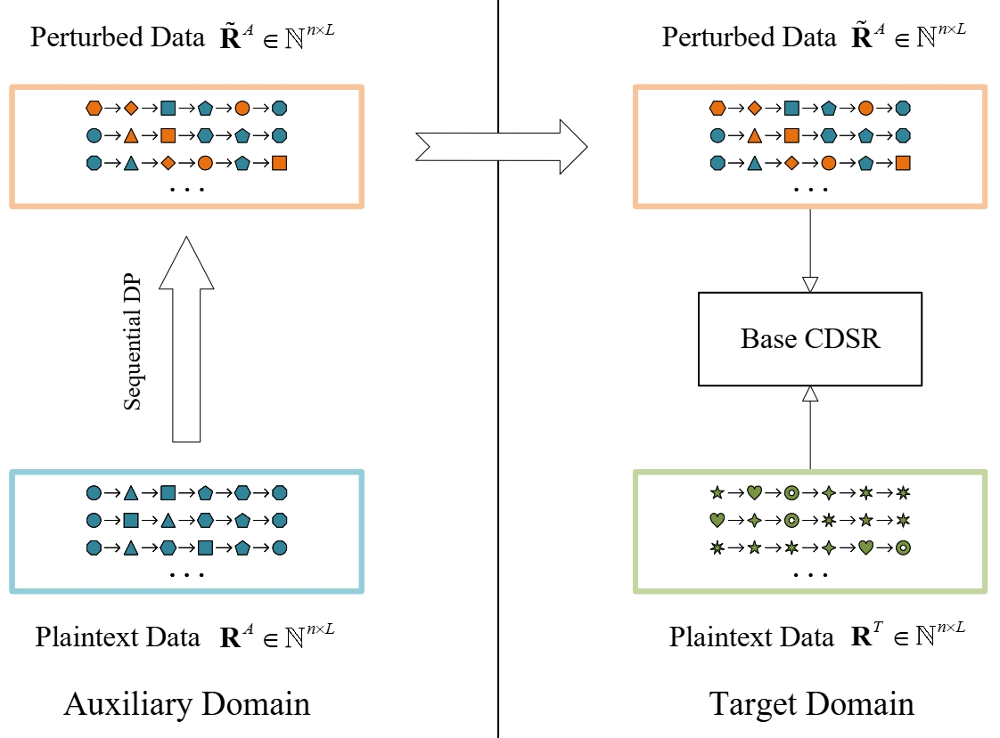</p>
   <p align="center"><em>The framework of PriCDSR.</em></p>
   </details>
  
* (_2024_) [CSCWD' 2024] **A Privacy-Preserving Method for Sequential Recommendation in Vertical Federated Learning** [[Paper](https://ieeexplore.ieee.org/document/10580731)]
  
   <details close>
   <summary>FedSeqRec</summary>
   <p align="center">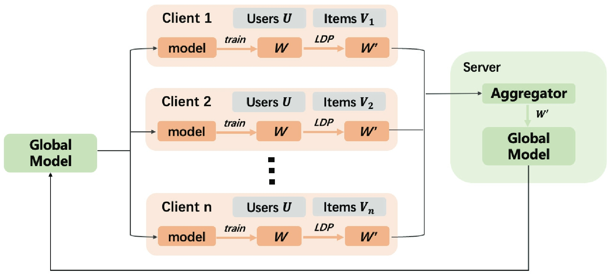</p>
   <p align="center"><em>The framework of FedSeqRec.</em></p>
   </details>
  
* (_2024_) [WWW' 2024] **Prompt-enhanced Federated Content Representation Learning for Cross-domain Recommendation** [[Paper](https://dl.acm.org/doi/10.1145/3589334.3645337) | [Code](https://github.com/Sapphire-star/PFCR)]
  
   <details close>
   <summary>PFCR</summary>
   <p align="center">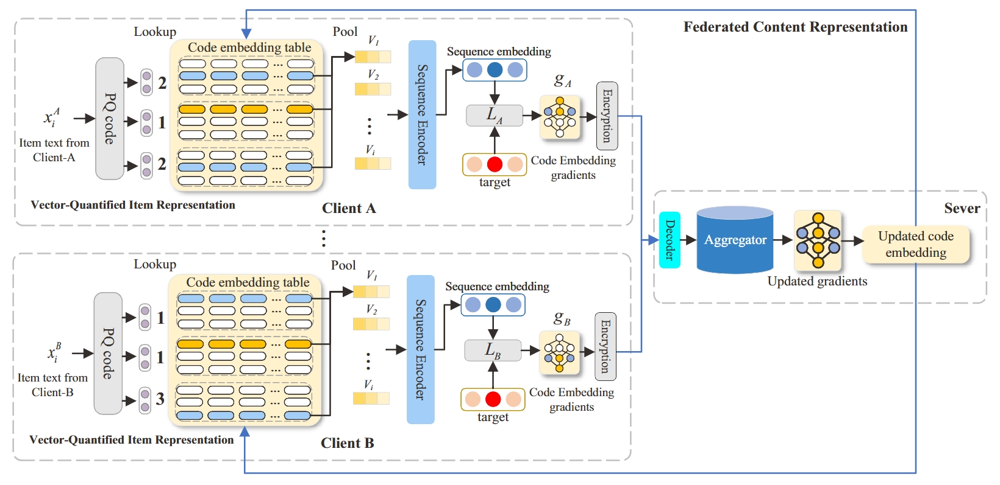</p>
   <p align="center"><em>The framework of PFCR.</em></p>
   </details>
   
* (_2025.01_) [COLING' 2025] **FedCSR: A Federated Framework for Multi-Platform Cross-Domain Sequential Recommendation with Dual Contrastive Learning** [[Paper](https://aclanthology.org/2025.coling-main.581.pdf) | [Code](https://github.com/zdy769243418/FedCSR-v1)]
  
   <details close>
   <summary>FedCSR</summary>
   <p align="center">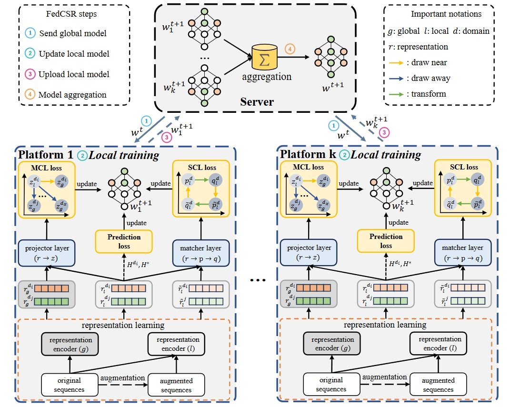</p>
   <p align="center"><em>The framework of FedCSR.</em></p>
   </details>
   
* (_2025.01_) [TCE' 2025] **Oh-FedRec: One-Shot  and Heterogeneous Vertical Federated Recommendation System** [[Paper](https://ieeexplore.ieee.org/document/10849618)]
  
   <details close>
   <summary>Oh-FedRec</summary>
   <p align="center">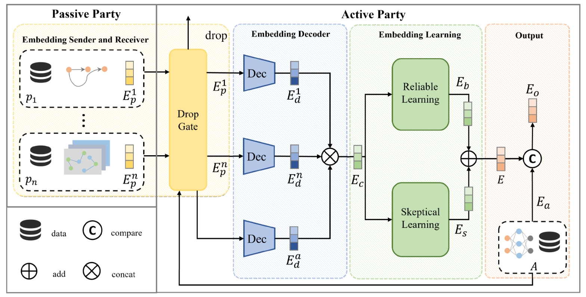</p>
   <p align="center"><em>The framework of Oh-FedRec.</em></p>
   </details>
   
* (_2025.03_) [arXiv' 2025] **Federated Mixture-of-Expert for Non-Overlapped Cross-Domain Sequential Recommendation** [[Paper](https://arxiv.org/abs/2503.13254)]
  
   <details close>
   <summary>FMoE-CDSR</summary>
   <p align="center">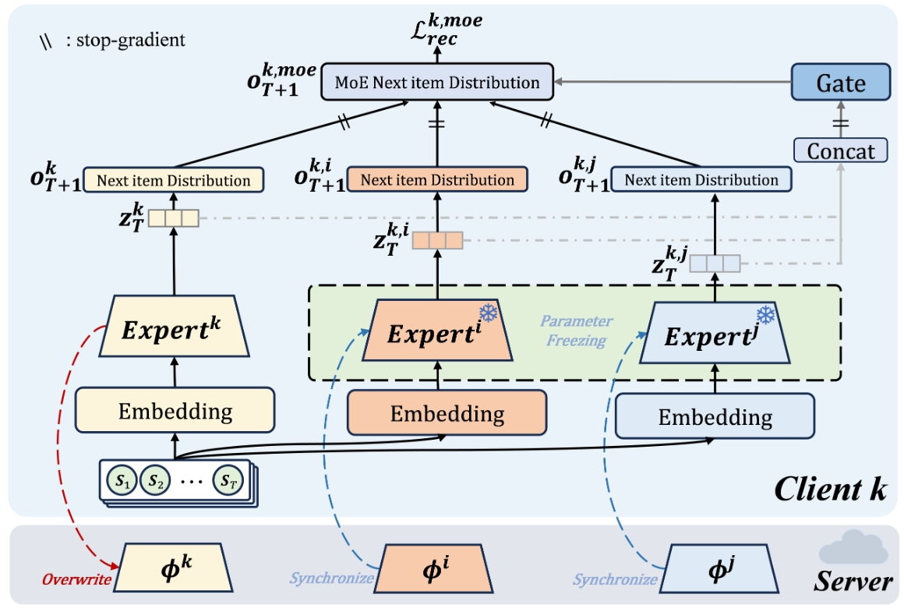</p>
   <p align="center"><em>The framework of FMoE-CDSR.</em></p>
   </details>
   
* (_2025.07_) [TOIS' 2025] **Federated Semantic Learning for Privacy-preserving Cross-domain Recommendation** [[Paper](https://dl.acm.org/doi/abs/10.1145/3728359) | [Code](https://github.com/Sapphire-star/FFMSR)]
  
   <details close>
   <summary>FFMSR</summary>
   <p align="center">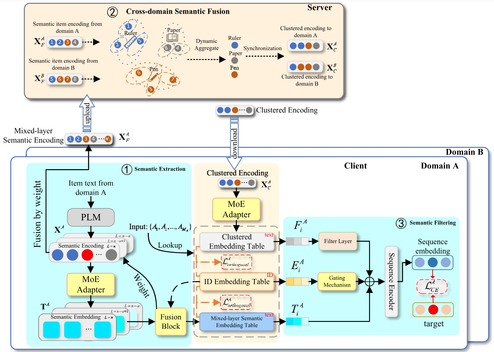</p>
   <p align="center"><em>The framework of FFMSR.</em></p>
   </details>

## Others

### Social Relations for FCDR

* (_2021_) [TKDE' 2021] **A Privacy-Preserving Distributed  Contextual Federated  Online Learning Framework with Big Data Support in Social  Recommender Systems** [[Paper](https://ieeexplore.ieee.org/document/8807242)]
  
   <details close>
     <summary>T-PriDO</summary>
     <p align="center">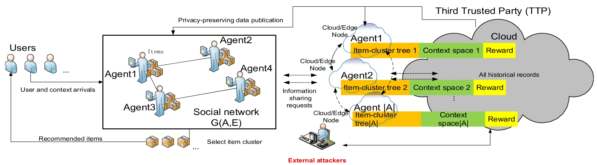</p>
     <p align="center"><em>The framework of T-PriDO.</em></p>
     </details>

* (_2021_) [NeurIPS' 2021] **Exploiting  Data Sparsity in Secure Cross-Platform Social Recommendation** [[Paper](https://proceedings.neurips.cc/paper/2021/file/56db57b4db0a6fcb7f9e0c0b504f6472-Paper.pdf)]
  
   <details close>
     <summary>S3Rec</summary>
     <p align="center">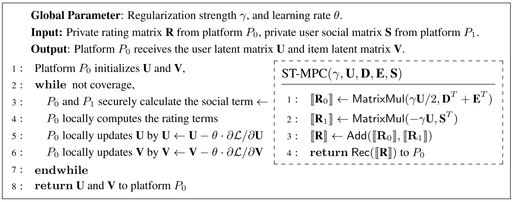</p>
     <p align="center"><em>The algorithm of S3Rec.</em></p>
     </details>

* (_2022_) [FL@IJCAI' 2022] **Privacy-Preserving  Federated Cross-Domain Social  Recommendation** [[Paper](https://link.springer.com/chapter/10.1007/978-3-031-28996-5_11)]
  
   <details close>
     <summary>FCSR</summary>
     <p align="center">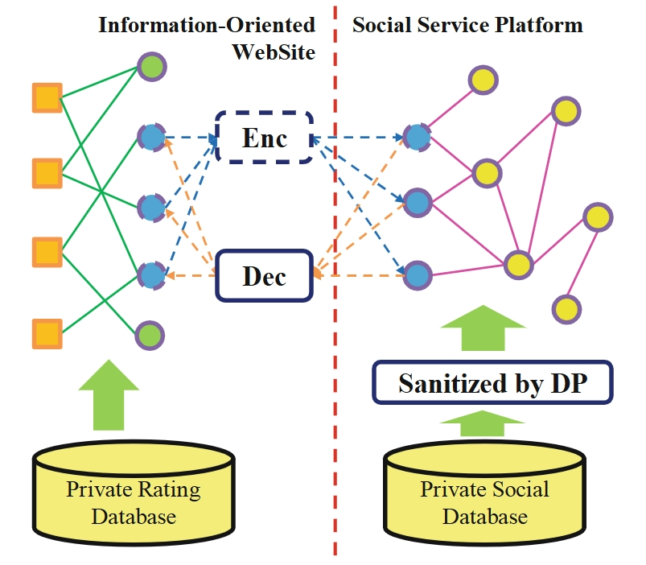</p>
     <p align="center"><em>The framework of FCSR.</em></p>
     </details>

* (_2022_) [TDSC' 2022] **Efficiency Boosting of Secure Cross-platform Recommender Systems over Sparse Data** [[Paper](https://ieeexplore.ieee.org/document/10713997)]
  
   <details close>
     <summary>S3Rec_sen</summary>
     <p align="center">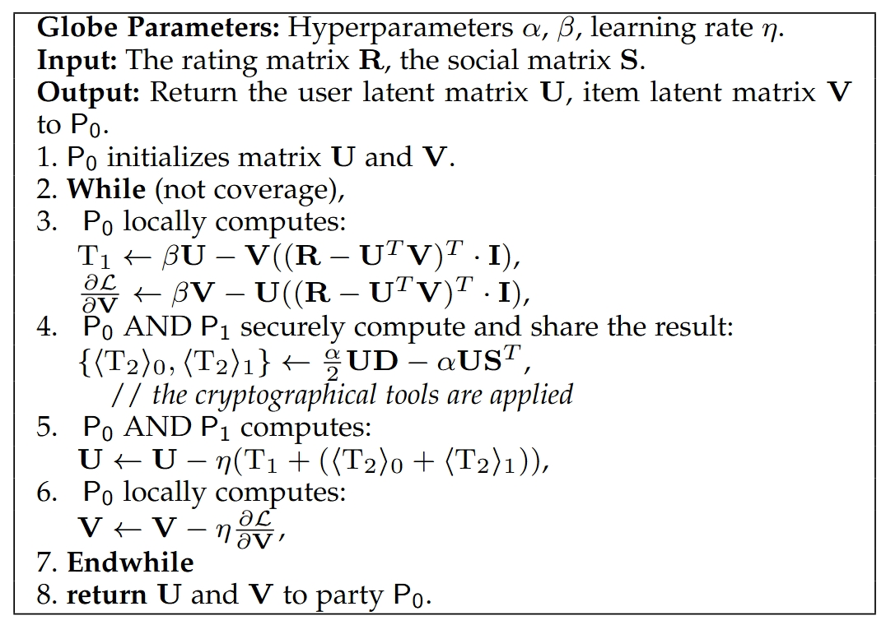</p>
     <p align="center"><em>The algorithm of S3Rec_sen.</em></p>
     </details>

* (_2023_) [ECAI' 2023] **Secure Social Recommendation based on Secret Sharing** [[Paper](http://ecai2020.eu/papers/609_paper.pdf) | [Code](https://github.com/encryptogroup/ABY)]
  
   <details close>
     <summary>SeSoRec</summary>
     <p align="center"></p>
     <p align="center"><em>The algorithm of SeSoRec.</em></p>
     </details>
   
* (_2025.04_) [WWW' 2025] **P4GCN: Vertical Federated Social Recommendation with Privacy-Preserving Two-Party Graph Convolution Network** [[Paper](https://dl.acm.org/doi/abs/10.1145/3696410.3714721)]
  
   <details close>
     <summary>P4GCN</summary>
     <p align="center"></p>
     <p align="center"><em>The framework of P4GCN.</em></p>
     </details>

### Item Information for FCDR

* (_2023_) [UAI' 2023] **Personalized  Federated Domain Adaptation for Item-to-Item Recommendation** [[Paper](https://arxiv.org/abs/2306.03191)]
  
   <details close>
   <summary>PFGNN+</summary>
   <p align="center"></p>
   <p align="center"><em>The framework of PFGNN+.</em></p>
   </details>
   
* (_2024_) [WWW' 2024] **Prompt-enhanced Federated Content Representation Learning for Cross-domain Recommendation** [[Paper](https://dl.acm.org/doi/10.1145/3589334.3645337) | [Code](https://github.com/Sapphire-star/PFCR)]
  
   <details close>
   <summary>PFCR</summary>
   <p align="center"></p>
   <p align="center"><em>The framework of PFCR.</em></p>
   </details>
   
* (_2025.07_) [TOIS' 2025] **Federated Semantic Learning for Privacy-preserving Cross-domain Recommendation** [[Paper](https://dl.acm.org/doi/abs/10.1145/3728359) | [Code](https://github.com/Sapphire-star/FFMSR)]
  
   <details close>
   <summary>FFMSR</summary>
   <p align="center"></p>
   <p align="center"><em>The framework of FFMSR.</em></p>
   </details>
   
* (_2025.11_) [CIKM' 2025] **DT-FedSDC: A Dual-Target Federated Framework with Semantic Enhancement and Disentangled Contrastive Learning for Cross-Domain Recommendation** [[Paper](https://dl.acm.org/doi/10.1145/3746252.3761270)]
  
   <details close>
   <summary>DT-FedSDC</summary>
   <p align="center"></p>
   <p align="center"><em>The framework of DT-FedSDC.</em></p>
   </details>

### Review Text for FCDR

* (_2023_) [MM' 2023] **Differentially Private Sparse Mapping  for Privacy-Preserving Cross Domain Recommendation** [[Paper](https://dl.acm.org/doi/10.1145/3581783.3611924)]

  <details close>
  <summary>DPSMRec</summary>
  <p align="center"></p>
  <p align="center"><em>The framework of DPSMRec.</em></p>
  </details>

* (_2025.03_) [TMM' 2025] **Federated User Preference Modeling  for Privacy-Preserving Cross-Domain Recommendation** [[Paper](https://ieeexplore.ieee.org/document/10909694) | [Code](https://github.com/Lili1013/FUPM)]

  <details close>
  <summary>FUPM</summary>
  <p align="center"></p>
  <p align="center"><em>The framework of FUPM.</em></p>
  </details>

### Knowledge Graph for FCDR

* (_2023_) [Information Sciences' 2023] **MuKGB-CRS: Guarantee Privacy and Authenticity of Cross-Domain Recommendation via Multi-Feature Knowledge Graph Integrated Blockchain** [[Paper](https://www.sciencedirect.com/science/article/pii/S0020025523004723)]
  
   <details close>
   <summary>MuKG</summary>
   <p align="center">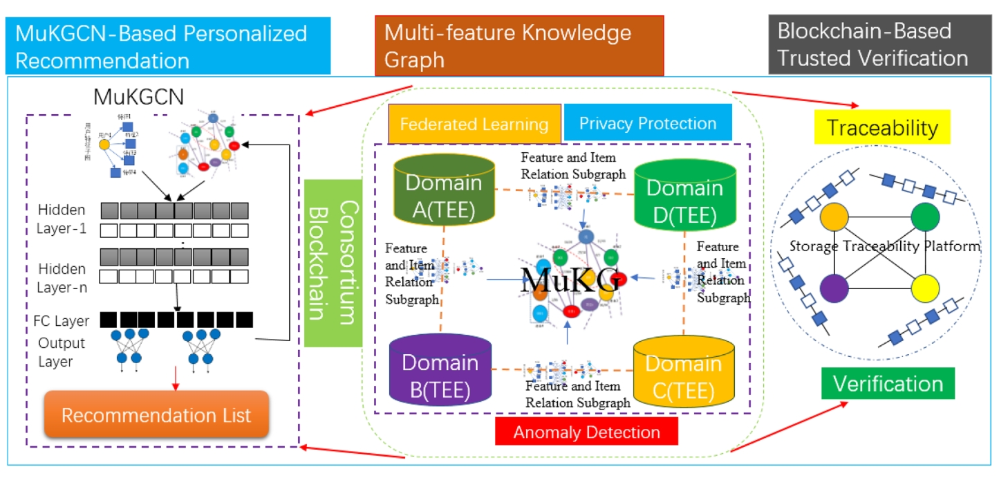</p>
   <p align="center"><em>The framework of MuKG.</em></p>
   </details>
   
* (_2023_) [GPC' 2023] **FEDRKG:  A Privacy-preserving Federated Recommendation Framework via Knowledge Graph  Enhancement** [[Paper](https://link.springer.com/chapter/10.1007/978-981-99-9896-8_6)]
  
   <details close>
   <summary>FEDRKG</summary>
   <p align="center"></p>
   <p align="center"><em>The framework of FEDRKG.</em></p>
   </details>
   
* (_2024_) [TMM' 2024] **Privacy-preserving Multi-source Cross-domain Recommendation Based on Knowledge Graph** [[Paper](https://dl.acm.org/doi/abs/10.1145/3639706)]
  
   <details close>
   <summary>Multi-source CDR</summary>
   <p align="center"></p>
   <p align="center"><em>The framework of Multi-source CDR.</em></p>
   </details>

### Multimodal Information for FCDR

* (_2024_) [KBS' 2024] **A Privacy-Preserving Framework with Multi-Modal Data for Cross-Domain Recommendation** [[Paper](https://www.sciencedirect.com/science/article/pii/S0950705124011638)]
  
     <details close>
   <summary>P2M2-CDR</summary>
   <p align="center"></p>
   <p align="center"><em>The framework of P2M2-CDR.</em></p>
   </details>
* (_2025.04_) [AAAI' 2025] **Enhancing Healthcare Recommendations: A Privacy-Protective and Interpretable Cross-Domain Framework** [[Paper](https://ojs.aaai.org/index.php/AAAI/article/view/33322) | [Code](https://github.com/zyl-mc/HCR)]
  
   <details close>
   <summary>HCR</summary>
   <p align="center"></p>
   <p align="center"><em>The framework of HCR.</em></p>
   </details>

## Summary of FCDR Model Performance

### Implicit Feedback for FCDR; FGD-CDR

<p align="center">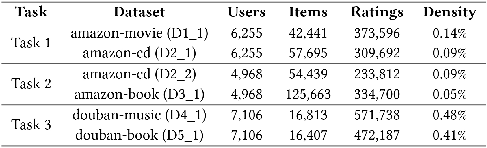</p>

<p align="center">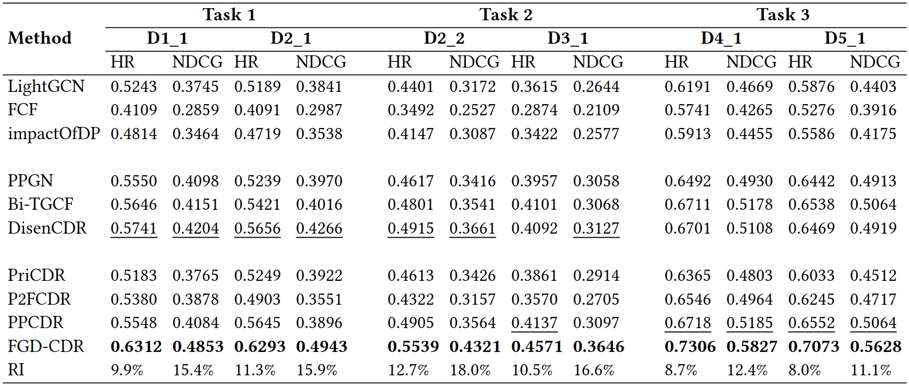</p>

<p align="left"><em>Table 3.</em> Overall Performance Comparison of FGD-CDR with Baseline Methods for All Tasks. Notice that the results are copied from FGD-CDR for reference.</p >

### Explicit Feedback for FCDR; PFCDR

<p align="center">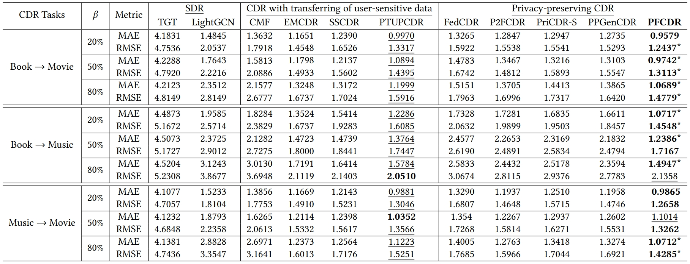</p>

<p align="left"><em>Table 4.</em> Cold-start results over 3 cross-domain tasks. We report the mean results over ten runs. Boldface denotes the best result, and the underline is secondary. ∗ indicates significant 0.05 levels, paired t-test of PFCDR vs. the best baselines. We assign the test (cold-start) users proportions 𝛽 as 20%, 50%, and 80% of total overlapping users, respectively. Notice that the results are copied from PFCDR for reference.</p >

### Sequential Feedback for FCDR; FFMSR

<p align="center">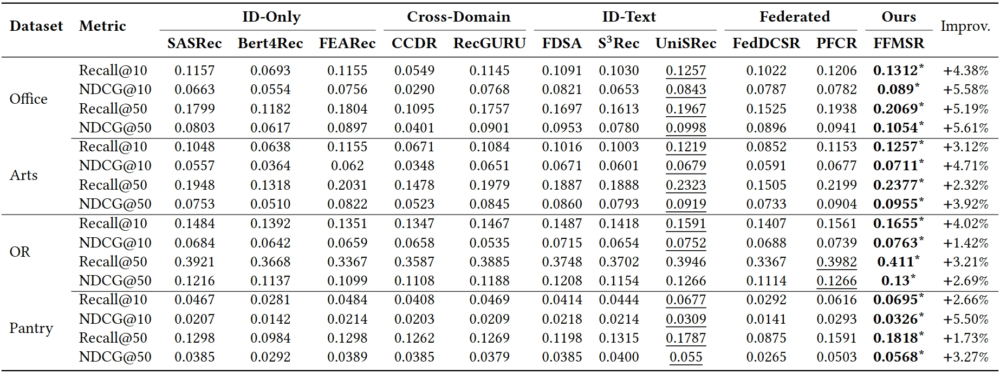</p>

<p align="left"><em>Table 5.</em> Comparison Results on Office-Arts and OnlineRetail-Pantry. Notice that the results are copied from FFMSR for reference.</p >

### Social Relations for FCDR; P4GCN

<p align="center">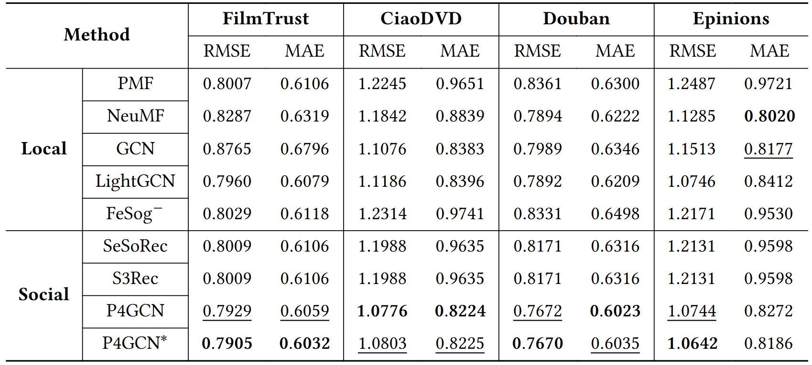</p>

<p align="left"><em>Table 6.</em> Comparison results of different models in terms of model accuracy (in RMSE and MAE). The optimal (second optimal) result of each column is bolded (underlined). P4GCN (ours) is set to satisfy (𝜖, 𝛿)-DP guarantee (e.g., 𝜖depends on the dataset) and P4GCN∗ corresponds to the ideal case without injecting DP noise. Notice that the results are copied from P4GCN for reference.</p >

### Item Information for FCDR; DT-FedSDC

<p align="center">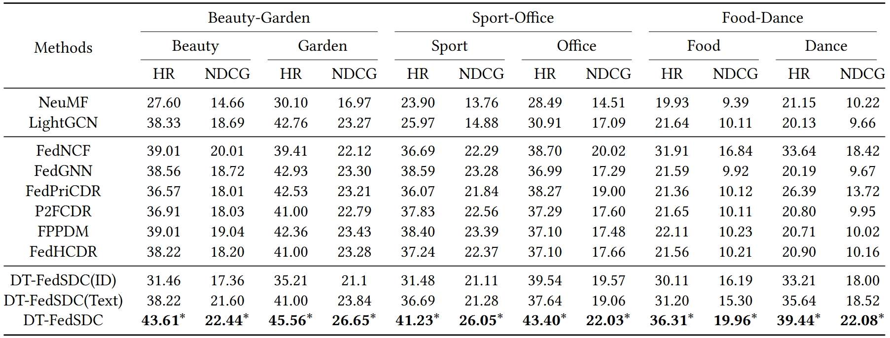</p>

<p align="left"><em>Table 7.</em> Performance comparison on three datasets (% omitted). The best results are highlighted in bold with *. Notice that the results are copied from DT-FedSDC for reference.</p >

### Review Text for FCDR; FUPM

<p align="center">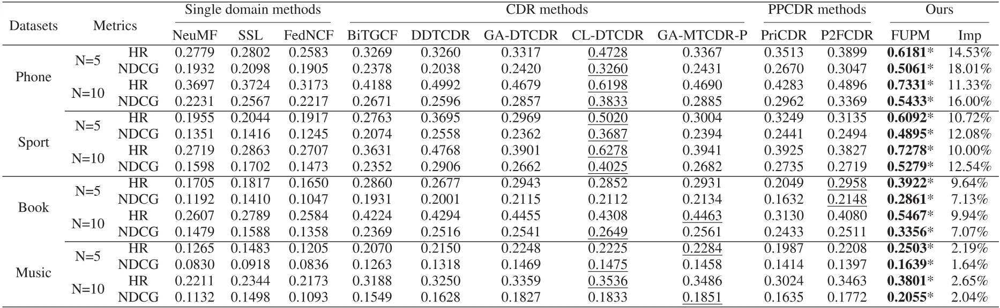</p>

<p align="center">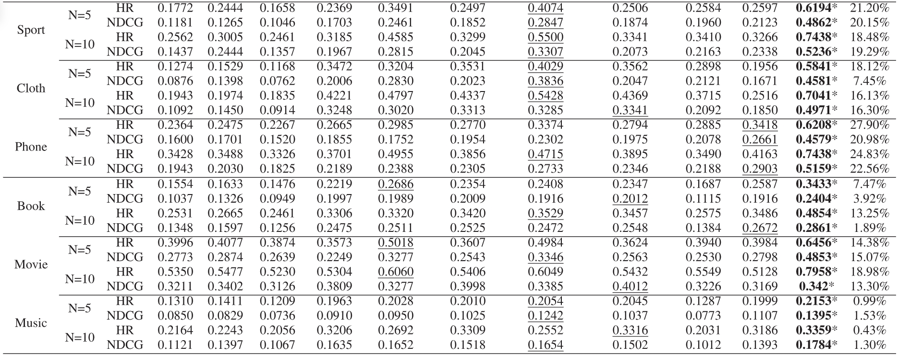</p>

<p align="left"><em>Table 8.</em> Experimental Results On Four CDR Tasks. The best performance is in bold, and the second best is underlined. The superscript "*" indicates the statistical significance for p < 0.01 compared to the best baseline. Notice that the results are copied from FUPM for reference.</p >

### Multimodal Information for FCDR; HCR

<p align="center">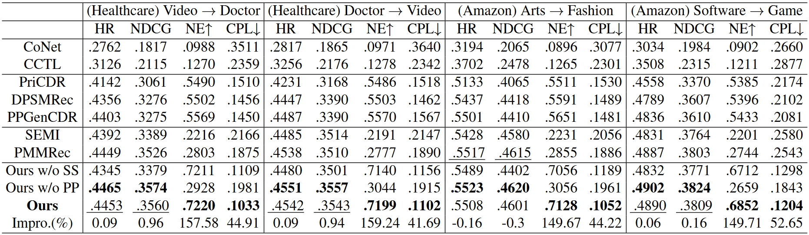</p>

<p align="left"><em>Table 9.</em> The recommendation performance and privacy protection of various recommendation models on cross-domain datasets. Notice that the results are copied from HCR for reference.</p >

## Contributing

If you have come across relevant resources, feel free to open an issue or submit a pull request.

```
* (_time_) [conference] **paper_name** [[Paper](link) | [Code](link)]
   <details close>
   <summary>Model name</summary>
   <p align="center"></p>
   <p align="center"><em>The framework of model name.</em></p>
   </details>
```

## Cite Us

Feel free to cite this work if you find it useful to you! ❤️

```
Awaiting publication
```


